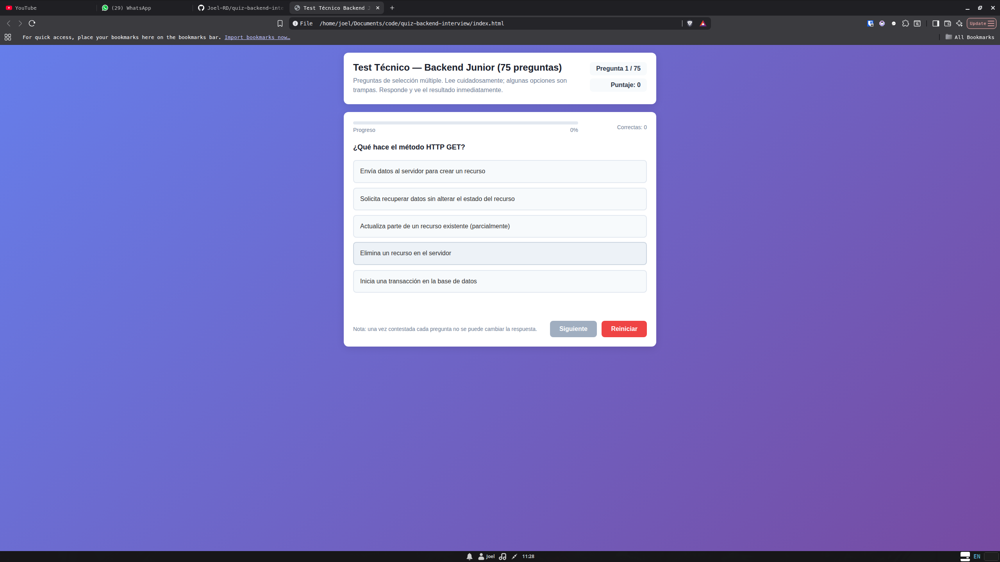

# Test Técnico — Backend Junior (75 Preguntas)

Este proyecto es una **aplicación web interactiva** para evaluar conocimientos de un candidato a **Backend Junior**.  
Consiste en un cuestionario de selección múltiple con retroalimentación inmediata, barra de progreso y un resumen final con puntaje.

---
# 🌟 Prompt para IA — Generar Quiz como Programador Back-End Senior

Actúa como un programador **Back-End Senior con más de 10 años de experiencia** en el desarrollo de aplicaciones web y evaluaciones técnicas.  
Aplica buenas prácticas de arquitectura, mantenibilidad del código y calidad en cada detalle.  

Quiero que generes un proyecto completo en un solo archivo `index.html` que contenga un quiz interactivo.  

---

## Requisitos

1. El quiz debe tener entre 50 y 100 preguntas de selección múltiple (con 4 a 5 opciones cada una y solo una correcta).  
2. La aplicación debe estar hecha únicamente con **HTML, CSS y JavaScript puro** (sin frameworks ni librerías externas).  
3. La interfaz debe incluir:  
   - Un encabezado con el título del quiz, número de la pregunta actual y puntaje.  
   - Una barra de progreso que muestre el avance.  
   - Preguntas renderizadas dinámicamente con sus opciones.  
   - Retroalimentación inmediata (**Correcto/Incorrecto**) al seleccionar una opción.  
   - Botón **Siguiente** para pasar a la próxima pregunta.  
   - Botón **Reiniciar** para comenzar de nuevo el test.  
   - Un **resumen final** con puntuación total y porcentaje de aciertos.  
4. El diseño debe ser **moderno, minimalista y responsive** (adaptado a móviles).  
5. Todas las preguntas deben estar en un arreglo de objetos en JavaScript con la siguiente estructura:  

   ```js
   {
     q: "Texto de la pregunta",
     opts: ["Opción A", "Opción B", "Opción C", "Opción D"],
     ans: 1 // índice de la respuesta correcta
   }

---

Un resumen final con puntuación total y porcentaje de aciertos.

El diseño debe ser moderno, minimalista y responsive (adaptado a móviles).

Todas las preguntas deben estar en un arreglo de objetos en JavaScript con la siguiente estructura:

{
q: "Texto de la pregunta",
opts: ["Opción A", "Opción B", "Opción C", "Opción D"],
ans: 1 // índice de la respuesta correcta
}

La lógica debe impedir cambiar de respuesta una vez seleccionada.

El puntaje y el progreso deben actualizarse en tiempo real.

Al finalizar, debe mostrarse un resumen con recomendaciones.

Estilo de código:

Usa JavaScript Vanilla limpio, modular y bien comentado.

HTML semántico y CSS con clases legibles y consistentes.

Implementa buenas prácticas para que las preguntas puedan editarse fácilmente.

Escribe el código como lo haría un Senior, priorizando claridad, escalabilidad y mantenibilidad.

Al final entrégame el archivo completo (index.html) listo para abrir en un navegador.
---

## ✨ Características

- **75 preguntas** de selección múltiple (solo una respuesta correcta).
- **Retroalimentación instantánea**: muestra si la respuesta es correcta o incorrecta.
- **Sistema de puntuación automático**.
- **Barra de progreso** que se actualiza en tiempo real.
- **Resumen final** con porcentaje de aciertos.
- **Botón de reinicio** para volver a empezar el test.
- **Responsive design**: optimizado para pantallas móviles y de escritorio.
- Interfaz cuidada con **HTML5, CSS3 y JavaScript puro** (sin dependencias externas).

---

## 📂 Estructura del Proyecto

El proyecto está contenido en un solo archivo:

- `index.html`: incluye la estructura HTML, los estilos en `<style>` y la lógica del quiz en `<script>`.

---

## 🚀 Uso

1. Clona o descarga este repositorio.
2. Abre el archivo `index.html` en tu navegador favorito.
3. Responde las preguntas seleccionando una opción.
4. Haz clic en **Siguiente** para avanzar.
5. Al finalizar, revisa tu **resumen de puntaje**.
6. Si deseas repetir el test, presiona el botón **Reiniciar**.

---

## 📸 Vista Previa



---

## 🔧 Tecnologías Utilizadas

- **HTML5** — estructura y semántica.
- **CSS3** — estilos modernos, diseño responsive, sombras y gradientes.
- **JavaScript (Vanilla)** — lógica del cuestionario, manejo de estado y eventos.

---

## 📝 Personalización

- Para **editar las preguntas**, modifica el arreglo `questions` dentro del `<script>`:
  ```js
  const questions = [
    {
      q: "¿Qué hace el método HTTP GET?",
      opts: [
        "Envía datos al servidor para crear un recurso",
        "Solicita recuperar datos sin alterar el estado del recurso",
        "Actualiza parte de un recurso existente (parcialmente)",
        "Elimina un recurso en el servidor",
        "Inicia una transacción en la base de datos"
      ],
      ans: 1
    },
    // ...
  ];
